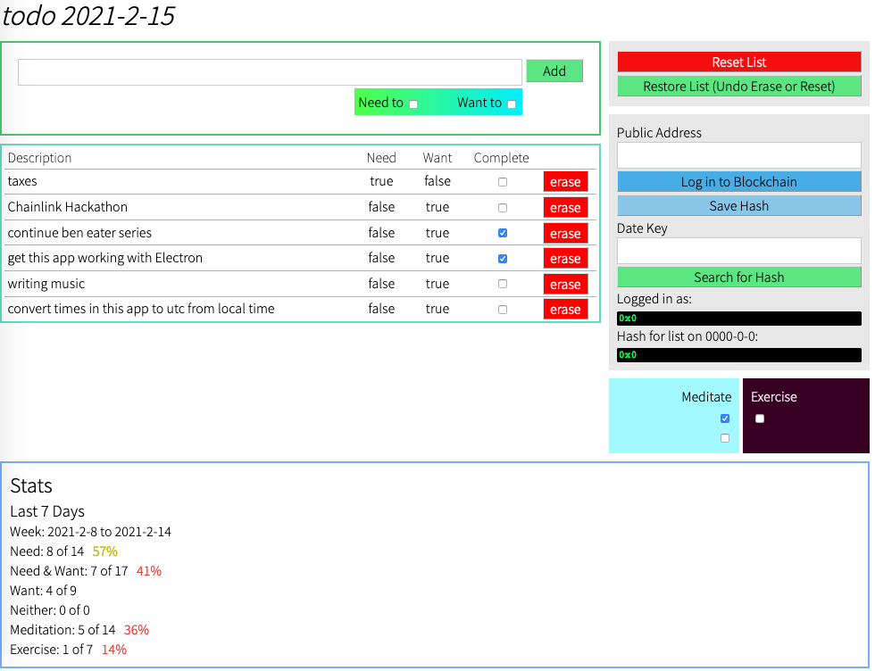

# Set up
### Prerequisites
#### MongoDB
https://www.mongodb.com/docs/manual/tutorial/install-mongodb-on-os-x/
1. `brew tap mongodb/brew`
2. `brew update`
3. `brew install mongodb-community@8.0`
4. `mongosh` to open the mongo shell
5. `use todo` to create the "todo" database  
Exit the mongo shell

### Build & Serve
1. `npm install`  
2. `npm run build-frontend`  
3. `npm run server-start`  

### Run
4. http://localhost:4635

# Why
Things you want to do probably exist along two axes: Want to, and Need to. If you Need to do it, but don't Want to, then you should make sure to prioritize it, because you have no independent motivation to get it done. The rest you'll get to because you like it.

### Notice on data integrity
List items are preserved from day-to-day because the server will copy them from the previous day to the current day in the middle of the night (4am). If the server is not running for over a day, old list items will be lost.

# Description
This application will auto-sort your To-Do's based on the two Need/Want criteria, where Need-Only always goes to the top, Need-Want is next, Want-Only comes after that, and Neither is last.

The __Stats__ section tracks your rolling 7-day  completion percentage in both categories for which Need is true.

Two items are persistent every day: Meditate and Exercise. These are referred to in the code as __Opposing Entropy__ A day is considered perfect with respect to these if you meditate twice and exercise once.

In general the goal is not 100% completion, because that would encourage gaming the system: intentionally omitting things from the list, splitting one important task into several to pump up your stats, etc. Just let it be an extension of your memory. An item is on the list not only to remind you to do it, but to let you feel free to focus on the highest-priority things without worrying that you'll miss out on anything else you were hoping to do.

Monthly and Yearly stats, as well as graphs are on the wish-list for this project, but the better it serves its basic function, the more infrequent updates have become.
